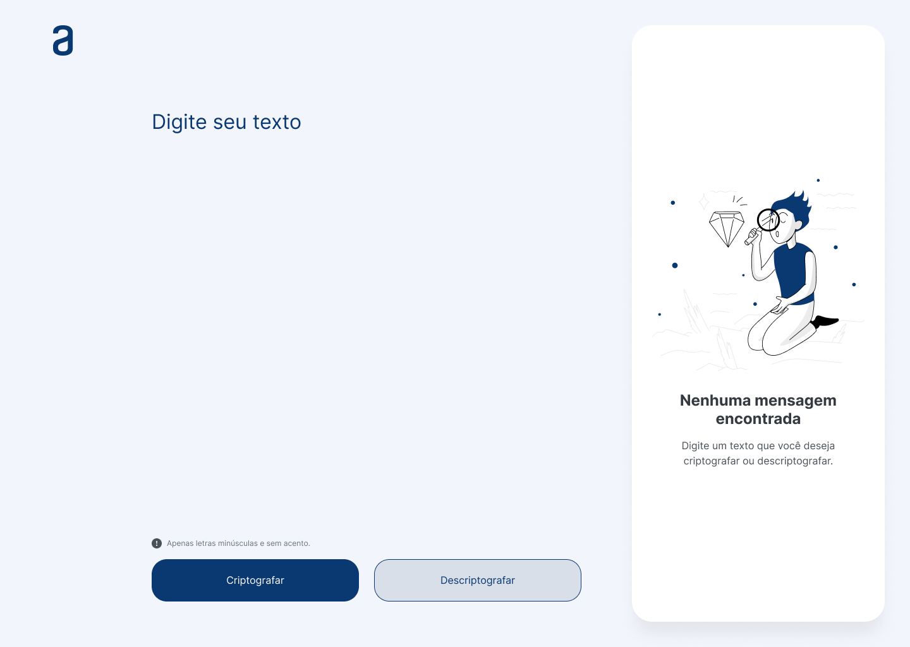

# Alura ONE - Challenge Codificador de Texto

[Alura ONE](https://www.oracle.com/br/education/oracle-next-education/)

### Breve descrição

O desafio de Codificador de Texto é baseado visualmente em um design no Figma para testar as habilidades de estruturação de páginas web com HTML possuindo designs já produzidos ou utilizando o próprio design, estilização com CSS e lógica de programação em JavaScript, utilizando boas práticas e todo conhecimento que foi trabalhado na Trilha Iniciante em Programação do programa Alura One. A ideia é que, com a entrada de um texto se tenha um resultado criptografado do mesmo e possa também descriptografar o texto resultado. Esse repositório no momento só possui a versão desktop.

## Projeto no Figma

Foto exemplo do Figma:

[Projeto do desafio no Figma](https://www.figma.com/file/tvFEYhVfZTjdJ5P24RGV21/Alura-Challenge---Desafio-1---L%C3%B3gica?node-id=16%3A802)

## Trello do Projeto

[Trello](https://trello.com/b/qmLsVkkq/decodificador-de-texto-alura-challenges-oracle-one)

## Futuras implementações

- Acessibilidade para tablet e celulares
- Modo escuro
- Design personalizado
- Adição de novas funcionalides
- Escolha de tipo de criptografia
- Melhorias gerais no CSS

## Cursos Iniciante em Programação T7 - ONE

- [Curso Lógica de programação: mergulhe em programação com JavaScript](https://www.alura.com.br/curso-online-logica-programacao-mergulhe-programacao-javascript)
- [Curso Lógica de programação: explore funções e listas](https://www.alura.com.br/curso-online-logica-programacao-funcoes-listas)
- [Curso ChatGPT: otimizando a qualidade dos resultados](https://www.alura.com.br/curso-online-chatgpt-otimizando-qualidade-resultados)
- [Curso HTML e CSS: ambientes de desenvolvimento, estrutura de arquivos e tags](https://www.alura.com.br/curso-online-html-css-ambiente-arquivos-tags)
- [Curso HTML e CSS: Classes, posicionamento e Flexbox](https://www.alura.com.br/curso-online-html-css-classes-posicionamento-flexbox)
- [Curso HTML e CSS: cabeçalho, footer e variáveis CSS](https://www.alura.com.br/curso-online-html-css-cabecalho-footer-variaveis-css)
- [Curso HTML e CSS: trabalhando com responsividade e publicação de projetos](https://www.alura.com.br/curso-online-html-css-responsividade-publicacao-projetos)
- [Curso Git e GitHub: compartilhando e colaborando em projetos](https://www.alura.com.br/curso-online-git-github-compartilhando-colaborando-projetos)
- [Curso Praticando lógica de programação: Challenge Decodificador de Texto](https://cursos.alura.com.br/course/challenge-decodificador-texto)

## Cursos Desenvolvimento Pessoal T7 - ONE

- [Curso Aprender a aprender: técnicas para seu autodesenvolvimento](https://cursos.alura.com.br/course/aprender-a-aprender-tecnicas-para-seu-autodesenvolvimento)
- [Curso LinkedIn: como fazer o seu perfil trabalhar para você](https://cursos.alura.com.br/course/linkedin-perfil-trabalhar-voce)
- [Curso Foco: trazendo mais resultados para o dia a dia](https://cursos.alura.com.br/course/foco-o-poder-do-habito-seu-dia-a-dia)
- [Curso Hábitos: da produtividade às metas pessoais](https://cursos.alura.com.br/course/habitos)
